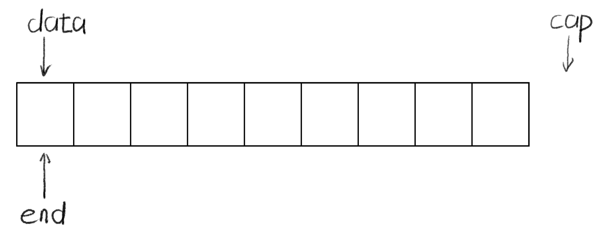

# lr-core-vector

用 C 语言手写一个 `std::vector`：你要做的事只有一件：根据 `include/vector.h` 的描述**把 `src/vector.c` 里的空壳函数填成能用的实现，让 `make test` 全绿**。

[vector 原理可视化](https://lingrui-studio.github.io/vector-playground/)

本题实现的是只存储 `int` 的教学版动态数组，具体约定以 [include/vector.h](include/vector.h) 为准。

## 目录结构

```
lr-core-vector/
├── readme.md         本文件
├── Makefile          构建脚本（不用改）
├── .gitignore        列举 git 需要忽视的文件
├── .clang-format     格式化要求
├── include/
│   └── vector.h      接口声明 + 函数注释（不用改，但要读懂）
├── src/
│   └── vector.c      ★ 你要实现的地方
└── tests/
    └── test.c        单元测试（不用改）
```

## 自检

项目根目录运行 `make test`，检查功能测试全部通过，并核对实现是否符合接口约定。

测试始终开启 ASan + UBSan，检测到错误会以失败状态退出，不提供关闭开关。常见错误会被直接指出来，例如：

```
ERROR: AddressSanitizer: heap-buffer-overflow on address 0x... at pc 0x...
READ of size 4 at 0x... thread T0
    #0 0x... in get src/vector.c:52
```

行号会直接指到出问题的那一行，看不懂的把完成代码和报错信息复制给 AI 问一下。

## 测试维护

维护题目时可运行 `sh tests/run_audit.sh`。它通过同一个 Makefile 将独立基准和错误变体链接到正式测试，检查正常实现通过、错误实现失败，不修改学生源码。

[tests/audit_probe.c](tests/audit_probe.c) 包含教师侧参考实现和故意错误的变体，不属于学生提交内容；发布学生练习包时不应包含该文件。修复记录见 [AUDIT.md](AUDIT.md)。

## 提交

- 完成下面的`实现思路`一节，简要说明你的各个函数是如何实现的，尤其注意内存管理的说明
- 把所有修改 commit 并 push 到 GitHub 上自己的 vector 仓库
- 在个人仓库的 Actions 页面手动触发一次自动评分工作流

## 实现思路
### vector_init
关键点在于在堆中申请内存，但`vector`整体是在栈上的，`data`,`end`,和`cap`指针分别指向堆上的内存
> `data`指针除了`realloc`之外不进行修改，保证其指向申请内存的起始，否则在`free`不仅不方便,而且找不到`malloc_chunk`(在glibc中)，易引发安全问题

### vector_destory
释放`data`指针指向的内存，千万不要写成
`free(v)`了，它是在栈上的。由于申请内存时堆分配器记录的内存的大小和位置等息，所以释放内存只需要写`free(v->data)`

### size和capacity
 由于申请的是一块连续的内存，所以直接相应指针相减即可
> 相减不需要除以4,这是因为在ISO C中除了`void*`外，指针加减会移动对应类型所占的字节数
### get,set,front和back
在 `data`指针的基础上进行偏移即可
### push_back,reserve和shrink_to_fit
先判断是否需要扩容，进行扩容时，使用`realloc`应注意:
- 先使用`new_ptr`接收，判断是否realloc成功，避免内存泄露
- 分类讨论申请内存为0的情况。在某些版本中，与`free(ptr)`可等同，要避免use-after-free；在C23中，这是未定义行为
> 记得移动`cap`指针


